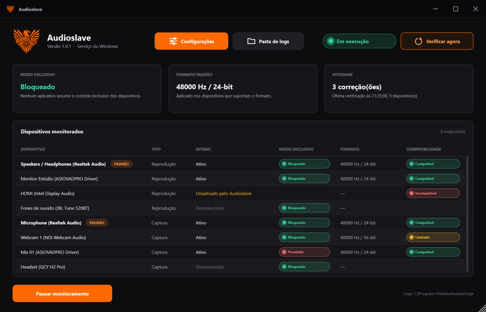
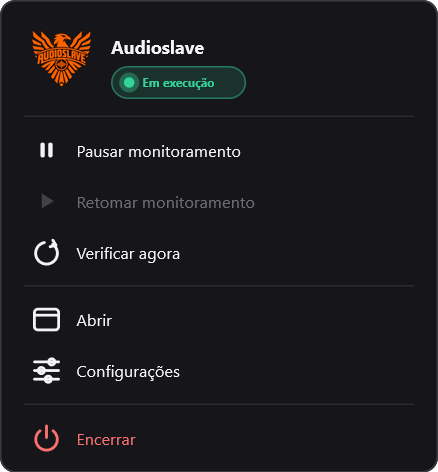
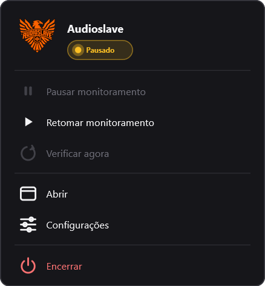
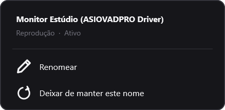
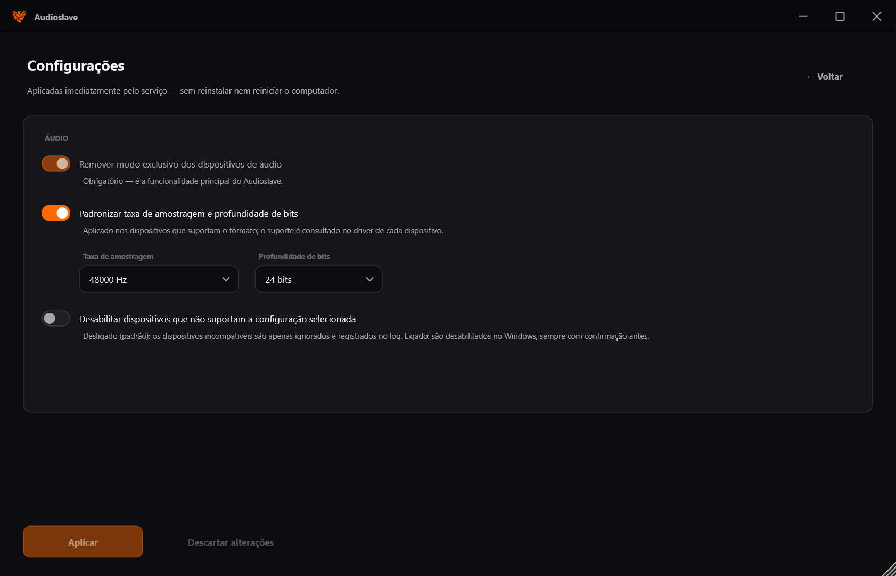
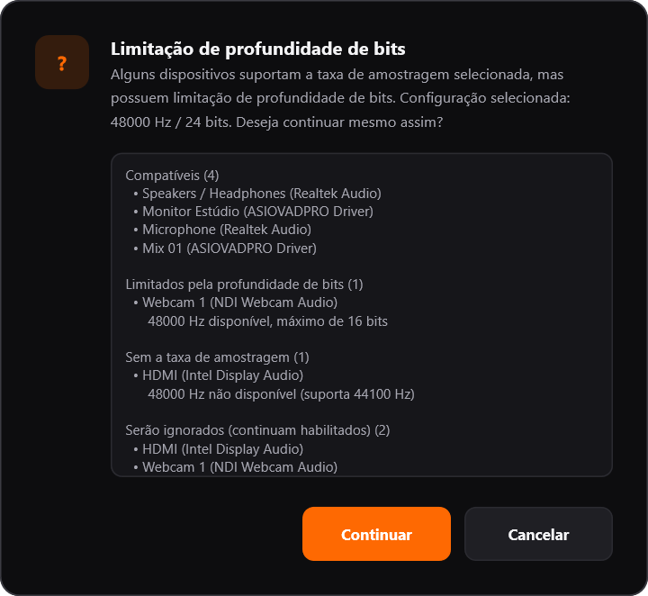
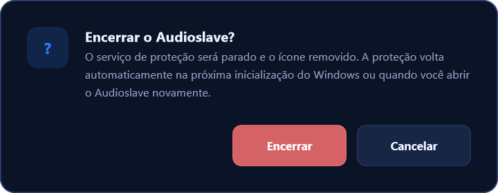
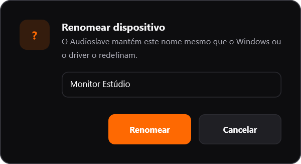
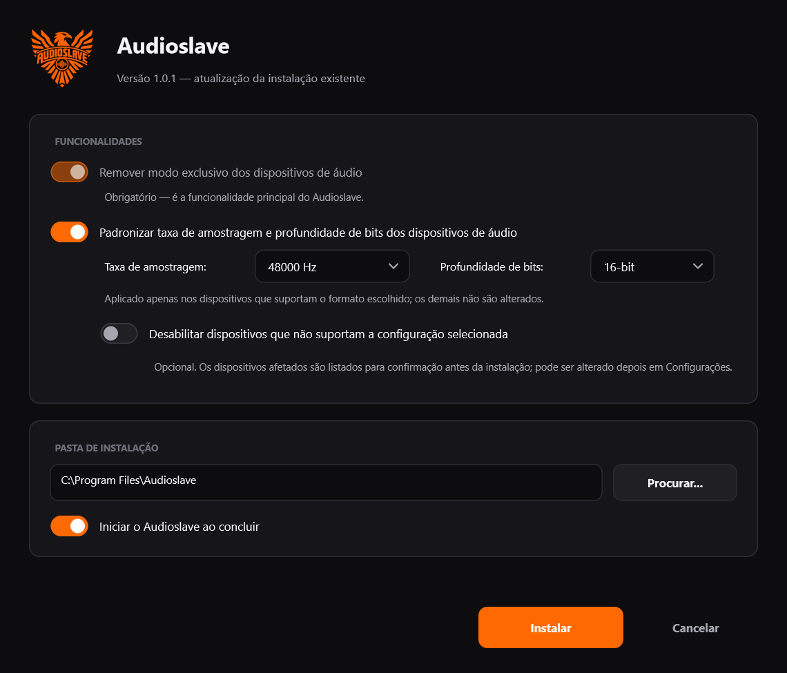

<p align="center">
  
</p>

<h1 align="center">Audioslave</h1>

<p align="center">
  Serviço do Windows open source feito em <b>JUCE</b> que mantém os dispositivos de áudio fora do <b>modo exclusivo</b><br>
  e, opcionalmente, padroniza a taxa de amostragem e a profundidade de bits.
</p>

<p align="center">
  
  
  
  
  
</p>

<p align="center">
  
</p>

---

## O que é o Audioslave

O **Audioslave** é um único executável nativo para Windows (C++20 + JUCE + APIs nativas do
Windows) que roda como **serviço do Windows** e vigia continuamente todos os dispositivos de
áudio de reprodução e de captura. Sempre que um dispositivo volta a permitir o **modo
exclusivo** — por causa de um aplicativo, de uma atualização de driver, do próprio Windows ou de
alguém mexendo no painel de Som — o Audioslave desliga o modo exclusivo de novo, confere se a
mudança ficou gravada e continua monitorando.

Um ícone na **bandeja do sistema** mostra o estado e permite pausar, retomar, verificar agora,
abrir a janela do Audioslave, mudar as configurações de áudio e encerrar a proteção.

O Audioslave usa **JUCE** para a aplicação, a interface, threads, IPC, configuração, logs e
testes, e as **APIs nativas do Windows** onde elas são a única forma correta de controlar o
sistema.

## O problema que resolve

O Windows permite que um aplicativo tome o **controle exclusivo** de uma placa de som (opção
*"Permitir que aplicativos assumam o controle exclusivo deste dispositivo"*). Enquanto isso
acontece, todos os outros programas perdem o acesso ao dispositivo: o navegador fica mudo, a
chamada cai, o OBS para de capturar, a automação de rádio perde a saída.

Desligar a opção manualmente não basta: drivers e atualizações do Windows costumam religá-la em
silêncio. O Audioslave trata essa configuração como uma política e a **reaplica sempre** que ela
muda.

## Principais funcionalidades

- **Remoção automática do modo exclusivo** em dispositivos de reprodução e de captura
  (ativos e desconectados), com releitura para confirmar cada correção
- **Detecção em tempo real** de dispositivos novos, removidos, reconectados, recriados e de
  mudanças de propriedade, mais uma **verificação periódica** de segurança
- **Padronização opcional de formato**: de 8000 a 384000 Hz e 16, 24 ou 32 bits — aplicada
  **somente** quando o driver informa que suporta o formato
- **Configurações na janela do Audioslave**: taxa de amostragem, profundidade de bits e política
  de dispositivos incompatíveis alteradas a qualquer momento, sem reinstalar, com uma prévia do
  que acontece com cada dispositivo antes de aplicar
- **Dispositivos incompatíveis**: apenas ignorados (padrão) ou, opcionalmente, desabilitados —
  sempre com confirmação, distinguindo *sem a taxa de amostragem* de *limitado pela
  profundidade de bits*, com reativação automática e proteção contra loops
- **Renomear dispositivos** pela janela: o nome é mantido mesmo que uma atualização do Windows
  ou do driver o redefina
- **Serviço do Windows** `Audioslave`: início automático, LocalSystem, funciona sem usuário
  logado, recuperação automática em falhas
- **Bandeja do sistema** em JUCE, tema escuro, com status em tempo real enviado pelo serviço e
  ícones gerados a partir do logo em cada tamanho do Windows (16 a 256 px), nítidos em qualquer
  escala de DPI; pausar, retomar e verificar sem fechar o menu
- **Pausar / retomar**: pausado, nenhum dispositivo é alterado; ao retomar há verificação completa
- **Canal de controle seguro** entre bandeja/CLI e serviço (named pipe com DACL própria)
- **Linha de comando** completa (status, pausa, diagnóstico, validação com JUCE)
- **Logs** com rotação e eventos no *Visualizador de Eventos*
- **Instalador e desinstalador** em JUCE, com modo silencioso e atualização no lugar

## Interface

### Bandeja do sistema

O ícone do Audioslave fica na área de notificações. Ao passar o mouse, o tooltip mostra:

> O Audioslave está em execução

<p>
  
  &nbsp;
  
</p>

| Item | O que faz |
|---|---|
| **Cabeçalho (status)** | Logo, nome e o estado atual (*Em execução*, *Pausado*, *Parado*...), atualizado ao vivo. Clique para abrir a janela. |
| **Pausar monitoramento** | Suspende as correções. O serviço continua em execução e recebendo eventos, mas nada é alterado. O ícone fica cinza e o estado aparece também no `services.msc`. **O menu continua aberto.** |
| **Retomar monitoramento** | Sai da pausa, relê a configuração e faz uma verificação completa. Se o serviço estiver parado, inicia o serviço. **O menu continua aberto.** |
| **Verificar agora** | Verificação completa imediata, consultando de novo os formatos de cada driver. **O menu continua aberto.** |
| **Abrir** | Janela do Audioslave (também com clique esquerdo no ícone). Fecha o menu. |
| **Configurações** | Janela do Audioslave direto nas configurações. Fecha o menu. |
| **Encerrar** | Pede confirmação, para o serviço de forma limpa (sem acionar a recuperação automática) e fecha o ícone. A proteção volta na próxima inicialização do Windows ou ao abrir o Audioslave. |

O ícone segue o protocolo de notificação atual do Windows (`NOTIFYICON_VERSION_4`): o menu abre
quando o clique termina, ao lado do ícone, e o ícone continua visível durante toda a interação,
inclusive na área de ícones ocultos. Dispositivos desabilitados ou reativados automaticamente
geram uma notificação.

### Janela do Audioslave

Estado ao vivo, as duas funcionalidades, atividade (correções e última verificação) e todos os
dispositivos monitorados: tipo, estado, modo exclusivo, formato e **compatibilidade** com o
formato escolhido (*Compatível*, *Limitado* pela profundidade de bits, *Incompatível* sem a taxa
de amostragem). Janela normal do Windows: minimizar, maximizar/restaurar (também com duplo clique
no título e *snap layouts*), fechar e redimensionar pelas bordas; posição, tamanho e estado
maximizado são lembrados por usuário.

No topo ficam **Configurações**, o estado e **Verificar agora**; embaixo, **Pausar/Retomar** e
**Pasta de logs**.

<p>
  
</p>

Clique com o botão direito em um dispositivo para **renomear** (o nome é aplicado no Windows e
mantido pelo Audioslave), deixar de manter o nome escolhido ou **reativar e manter habilitado** um
dispositivo que o Audioslave desabilitou.

### Configurações

<p>
  
</p>

As configurações de áudio definidas no instalador podem ser alteradas aqui a qualquer momento,
**sem reinstalar e sem reiniciar o computador**: padronização de formato, taxa de amostragem
(8000 a 384000 Hz), profundidade de bits (16, 24 ou 32) e *Desabilitar dispositivos que não
suportam a configuração selecionada*. Ao clicar em **Aplicar**, o serviço analisa cada dispositivo
e mostra o que vai acontecer; quando há algo a decidir, pede confirmação:

<p>
  
  &nbsp;
  
</p>

Depois de aplicar, um relatório lista o que não pôde ser configurado e por quê (por exemplo
*"48000 Hz não disponível"* ou *"48000 Hz disponível, máximo de 16 bits"*) e o que foi
desabilitado. O Audioslave nunca reduz a configuração global por causa do dispositivo mais
limitado: a decisão é sempre sua.

### Diálogos e instalador

<p>
  
  &nbsp;
  
</p>
<p>
  
</p>

## Arquitetura

```
                ┌──────────────────────── Audioslave.exe ────────────────────────┐
                │                                                                  │
  SCM ─────────▶│ --service ─▶ WindowsService ─▶ ServiceHost                       │
                │                                  ├─ WatchdogEngine (juce::Thread)│
                │                                  │   ├─ ExclusiveModePolicy      │
                │                                  │   ├─ FormatPolicy             │
                │                                  │   └─ EndpointMemory (backoff) │
                │                                  ├─ WindowsAudioDeviceWatcher ───┼─ IMMNotificationClient
                │                                  └─ PipeServer ◀─────────────┐   │
                │                                                              │   │
                │ (sem argumentos) ─▶ JUCEApplication (bandeja)                │   │
                │                      ├─ TrayIcon / TrayMenu / StatusWindow   │   │
                │                      └─ ControlClient ─────────── \\.\pipe\Audioslave.Control
                │                                                              │   │
                │ <comando> ─▶ CLI (juce::ConsoleApplication) ─ ControlClient ─┘   │
                └──────────────────────────────────────────────────────────────────┘
       audio/windows: Enumerator · ExclusiveModePolicy · AudioFormatPolicy · FormatSupport
       audio/juce:    JuceAudioDeviceInventory · JuceExclusiveModeProbe
```

- **Um único executável**: bandeja (sem argumentos), serviço (`--service`) e CLI.
- O **serviço** é quem protege; a bandeja é só interface. Fechar a bandeja nunca para a proteção.
- **Mesmo caminho para todos os comandos**: pausa/retomada/parada vindas do SCM, da bandeja ou
  da CLI passam pelo mesmo código no `ServiceHost`, então `services.msc`, o motor e a bandeja
  nunca discordam.
- **Modo portátil**: sem serviço instalado, a bandeja executa o mesmo `ServiceHost` numa thread
  do próprio processo (alterar dispositivos exige executar como administrador).
- A camada de áudio fica atrás de interfaces (`IAudioEndpointEnumerator`, `IExclusiveModeStore`,
  `IAudioFormatStore`), então toda a lógica é testada sem tocar em dispositivos reais.

### JUCE

| Onde | Classe JUCE |
|---|---|
| Aplicação da bandeja, ciclo de vida, logoff | `JUCEApplication`, `MessageManager` |
| Ícone e menu da bandeja | `SystemTrayIconComponent`, `PopupMenu` |
| Janela, configurações, diálogos, instalador | `DocumentWindow`, `Component`, `TableListBox`, `LookAndFeel_V4` (tema próprio) |
| Worker do monitoramento | `juce::Thread` (`wait` / `notify`), `CriticalSection`, `ThreadSafeListenerList` |
| Canal de controle (cliente) | `InterprocessConnection` |
| Protocolo | `juce::JSON`, `var`, `MemoryBlock` |
| Configuração e logs | `File`, `String`, `FileOutputStream`, `juce::Logger` |
| CLI | `ConsoleApplication`, `ArgumentList` |
| COM | `ComSmartPtr` |
| Validação de áudio | `AudioIODeviceType` WASAPI (compartilhado e **exclusivo**) |
| Testes | `UnitTest`, `UnitTestRunner` |
| Recursos embutidos | `juce_add_binary_data`, `ImageCache` |

### Windows Core Audio e WASAPI

- **MMDevice API** (`IMMDeviceEnumerator`, `IMMDevice`, `IPropertyStore`): enumeração com IDs
  estáveis, incluindo endpoints desconectados, e a política do modo exclusivo.
- **`IMMNotificationClient`**: avisos de dispositivo adicionado, removido, estado, padrão e
  **mudança de propriedade** (é assim que o Audioslave percebe o Windows religando o modo
  exclusivo).
- **DeviceTopology** (`IDeviceTopology`, `IConnector`, `IPart`, **`IKsFormatSupport`**): pergunta
  ao driver quais formatos ele suporta.
- **`IPolicyConfig`**: aplica o formato padrão exatamente como o painel de Som.
- **WASAPI** via JUCE: validação comportamental (`validate`, `diagnose --probe-exclusive`).

### Windows Service, bandeja e IPC

- Serviço `Audioslave`, conta LocalSystem, início automático, recuperação *reiniciar o serviço*
  em 5 s / 10 s / 30 s (reset em 1 dia, inclusive em paradas com erro), DACL que permite a
  usuários interativos iniciar, parar e pausar/retomar **este** serviço (bandeja sem admin).
- Bandeja: uma por sessão do Windows (inclusive Área de Trabalho Remota).
- IPC: `\\.\pipe\Audioslave.Control`, servidor nativo com DACL explícita (SYSTEM,
  Administradores, Usuários Interativos), `PIPE_REJECT_REMOTE_CLIENTS`, primeira instância
  exclusiva, E/S sobreposta; mensagens JSON no mesmo formato de quadro da
  `juce::InterprocessConnection`. O estado é **enviado** pelo serviço a cada mudança.

## Por que JUCE? (Why JUCE?)

A JUCE é o framework que a Playlist usa nos seus produtos de áudio. No Audioslave ela é a base
da **aplicação** — bandeja, janelas, diálogos, instalador, threads, IPC do lado cliente, JSON,
arquivos, logs, CLI e testes — com um tema visual único e código portátil e testável.

O que a JUCE **não** faz é administrar a política dos endpoints do Windows, e o Audioslave não
finge que faz: o tipo WASAPI da JUCE lista só dispositivos ativos, identifica-os pelo nome e não
avisa mudanças de propriedade; o modo exclusivo da JUCE depende de
`IAudioClient::IsFormatSupported(EXCLUSIVE)`, que falha justamente depois que o Audioslave
bloqueia o modo exclusivo; e não existe API JUCE para o *property store*, `IPolicyConfig`,
`IKsFormatSupport` ou o SCM. Essas partes continuam nativas, centralizadas em
`src/audio/windows`, `src/platform/windows` e `src/service`.

Onde a JUCE agrega no áudio, ela é usada: `Audioslave validate` abre cada dispositivo pelo tipo
**"Windows Audio (Exclusive Mode)"** da JUCE — o mesmo caminho que um player JUCE usaria — e
confirma que nenhum consegue o controle exclusivo; `Audioslave devices` mostra os nomes dos
dispositivos exatamente como um app JUCE os vê.

## Configuração

`C:\ProgramData\Audioslave\config.ini` (criado pelo instalador; só administradores e o serviço
alteram — as **Configurações** da janela gravam por meio do serviço):

```ini
[Features]
ExclusiveModeProtection=true   ; função principal
FormatStandardization=false    ; padronização de formato (opcional)
SampleRate=48000               ; 8000 | 11025 | 12000 | 16000 | 22050 | 24000 | 32000 | 44100
                               ; 48000 | 88200 | 96000 | 176400 | 192000 | 352800 | 384000
BitDepth=24                    ; 16 | 24 | 32
DisableIncompatibleDevices=false ; true = desabilitar os dispositivos sem suporte ao formato
DisableConfirmedFor=           ; gravado pela confirmação (taxa:bits); não editar

[Monitor]
Playback=true                  ; dispositivos de reprodução
Capture=true                   ; dispositivos de captura
CheckIntervalSeconds=60        ; verificação periódica (1..86400)

[Logging]
Enable=true
Level=INFO                     ; DEBUG | INFO | WARN | ERROR

[Behavior]
Enforce=true                   ; false = apenas relatar, nunca alterar

[DeviceNames]                  ; nomes escolhidos na janela (id do endpoint = nome)
{0.0.0.00000000}.{...}=Monitor Estúdio
```

Valores inválidos voltam ao padrão com aviso no log. Alterações feitas na janela (ou com
`Audioslave configure`) valem **na hora**; edições manuais valem ao **retomar** o monitoramento,
ao reiniciar o serviço ou com `sc control Audioslave paramchange`.

`C:\ProgramData\Audioslave\devices.json` é o estado do serviço (não é configuração): os
dispositivos que o próprio Audioslave desabilitou, o motivo, quando e os formatos que eles
suportavam — é o que permite reativá-los com segurança.

## Exclusive Mode

- A opção *"Permitir que aplicativos assumam o controle exclusivo"* é a propriedade
  `{B3F8FA53-0004-438E-9003-51A46E139BFC},3` do endpoint (`,4` = *"dar prioridade aos
  aplicativos no modo exclusivo"*), `VT_UI4`, `0` = bloqueado. Propriedade ausente significa o
  padrão do Windows (**permitido**) e é corrigida.
- Gravação por `IMMDevice::OpenPropertyStore(STGM_READWRITE)` → `SetValue` → `Commit()`, sempre
  seguida de **releitura**; se o estado não puder ser lido, nada é gravado.
- Reação: notificações → *debounce* → verificação; periódica como rede de segurança; um endpoint
  recriado é tratado como novo.
- **Sem loops**: se um driver rejeitar a mudança, verificações disparadas por notificação deixam
  aquele dispositivo em espera por 30 s; a verificação periódica tenta de novo.
- Validação comportamental: `Audioslave validate`.

## Audio Format Standardization

Funcionalidade **opcional** e independente. Antes de alterar qualquer dispositivo, o Audioslave
pergunta **ao driver** (`IKsFormatSupport`) se o formato é suportado:

```
[AudioFormat] Device: Webcam 1 (NDI Webcam Audio) | ID: {0.0.1.00000000}.{84c3...} | Type: capture |
Current: 48000 Hz / 16-bit | Requested: 48000 Hz / 24-bit | Supported: 11025, 22050, 44100, 48000 Hz / 16-bit |
Result: Incompatible (bit depth) | Reason: requested bit depth is not supported (48000 Hz is available
only at 16-bit, not 24-bit) | Action: Ignored (device left as it is)
```

- A lista de taxas é o que você pode **escolher**; o que cada dispositivo **suporta** é sempre
  perguntado ao driver (todas as taxas × profundidades, em ~1–3 ms por dispositivo, guardado em
  cache e consultado de novo quando o dispositivo muda ou em *Verificar agora*).
- Nunca troca por outro formato: sem suporte, o dispositivo é pulado e registrado no log (uma vez).
- 24 bits = 24/24 ou 24-em-32; 32 bits = inteiro ou ponto flutuante — o que o driver aceitar.
- Aplicado com `IPolicyConfig`, como o painel de Som: o motor de áudio usa o novo formato na hora.
- Só em dispositivos ativos.

### Dispositivos incompatíveis

Um dispositivo pode não suportar a **taxa de amostragem** escolhida, ou suportá-la mas **não na
profundidade de bits** escolhida (por exemplo 48000 Hz apenas em 16 bits quando 24 foi
escolhido). Os dois casos são mostrados e registrados separadamente.

| Opção *Desabilitar dispositivos que não suportam a configuração selecionada* | O que acontece |
|---|---|
| **Desligada** (padrão) | O dispositivo é **ignorado**: continua habilitado e o motivo vai para o log. |
| **Ligada** | O dispositivo é **desabilitado** no Windows (como *Desabilitar* no painel de Som), com verificação e registro de data/hora, dispositivo, id, motivo, formato pedido e ação. |

- **Nunca silenciosamente**: antes da primeira execução a lista do que será desabilitado é
  mostrada (janela, instalador ou `configure --yes` na CLI). A confirmação vale para aquele
  formato; mudar o formato pede uma nova. Se a opção for ligada à mão no `config.ini`, a bandeja
  pede a confirmação e, até lá, nada é desabilitado.
- **Monitoramento contínuo**: dispositivos novos ou recriados pelo Windows são avaliados na hora;
  desabilitações automáticas geram uma notificação na bandeja.
- **Reativação**: o Audioslave só reativa dispositivos que **ele mesmo** desabilitou — quando
  passam a suportar o formato escolhido ou quando a opção é desligada. Dispositivos desabilitados
  por você nunca são tocados.
- **Como serviço**: se um dispositivo incompatível for habilitado de novo (no painel de Som, pelo
  Windows ou pelo driver), ele é desabilitado de novo na hora. Só *Reativar e manter habilitado*,
  no menu do dispositivo na janela, o deixa habilitado até a configuração mudar.
- **Sem loops**: um dispositivo recriado sem parar (mais de 5 vezes em 10 minutos) espera esse
  intervalo passar antes de ser desabilitado de novo.
- **Dispositivos desconectados** nunca são considerados: sem formatos visíveis, não são tratados
  como incompatíveis nem desabilitados.

## Instalação

1. Baixe `Audioslave-Setup.exe` em [Releases](https://github.com/caio-kenai/Audioslave/releases).
2. Execute e aceite o UAC.
3. Escolha as opções e clique em **Instalar**.

O instalador copia `Audioslave.exe` e `Uninstall.exe`, cria `logs\`, grava a configuração
(preservando a existente), instala e inicia o serviço, registra a bandeja no logon de todos os
usuários, cria a pasta **Audioslave** no Menu Iniciar e a entrada em *Aplicativos*.

```bat
Audioslave-Setup.exe /S                        :: instalação silenciosa (mantém a configuração)
Audioslave-Setup.exe /S /format=48000:24       :: ativa a padronização (taxa:bits)
Audioslave-Setup.exe /S /noformat              :: desativa a padronização
Audioslave-Setup.exe /S /format=48000:24 /disableincompatible :: e desabilita os incompatíveis
Audioslave-Setup.exe /S /dir="D:\Apps\Audioslave" /notray
```

O instalador oferece as mesmas opções de áudio da janela, incluindo *Desabilitar dispositivos
que não suportam a configuração selecionada* (desmarcada por padrão; quando marcada, os
dispositivos afetados são listados para confirmação antes de instalar). Com a padronização
ligada, o instalador também avisa, com *Continuar* / *Cancelar*, sobre dispositivos limitados pela
profundidade de bits ou sem a taxa de amostragem, como a tela de Configurações. Tudo pode ser alterado
depois em **Configurações**.

**Atualização**: basta executar o instalador de uma versão nova.

## Desinstalação

*Configurações → Aplicativos → Audioslave*, o atalho **Desinstalar Audioslave** ou
`Uninstall.exe` (`/S` silencioso, `/removedata` remove também logs e configuração). Remove
serviço, executáveis, inicialização automática, atalhos, entrada em *Aplicativos* e origem do Log
de Eventos. Logs e configuração são mantidos por padrão. As configurações de áudio já aplicadas
aos dispositivos não são revertidas.

## Logs

| Arquivo | Conteúdo |
|---|---|
| `<instalação>\logs\audioslave.log` | Serviço: início/parada, dispositivos, correções, formatos, comandos, erros |
| `<instalação>\logs\tray.log` | Bandeja: conexão, pausar, retomar, encerrar |
| `<instalação>\logs\setup.log` | Instalações, atualizações e desinstalações |

Rotação a cada 5 MB (5 cópias). Correções e falhas graves também vão para *Visualizador de
Eventos → Aplicativo*, origem **Audioslave**. Mensagens internas da JUCE caem no mesmo log.

## CLI

`Audioslave.exe` sem argumentos abre a bandeja. Comandos:

| Comando | Descrição |
|---|---|
| `status` | Estado do serviço (SCM) e status ao vivo do monitoramento |
| `pause` / `resume` | Pausa / retoma (sem administrador) |
| `rescan` | Pede ao serviço uma verificação completa agora |
| `start` / `stop` / `restart` | Ciclo de vida do serviço |
| `install` / `uninstall` | Registra / remove só o serviço (administrador) |
| `scan` | Uma verificação neste processo |
| `devices` | Endpoints, modo exclusivo, formato atual, taxas e profundidades suportadas, nomes vistos pela JUCE |
| `analyze [--rate=N] [--bits=N] [--format=on\|off] [--disable-incompatible=on\|off]` | Prévia do que as configurações fariam com cada dispositivo (nada é alterado) |
| `configure [mesmas opções] [--yes]` | Grava e aplica as configurações pelo serviço (desabilitar incompatíveis exige `--yes`) |
| `rename <id> <nome>` / `rename <id> --release` | Renomeia um dispositivo e mantém o nome / deixa de manter |
| `enable <id>` | Reativa um dispositivo desabilitado pelo Audioslave |
| `diagnose [--probe-exclusive]` | Autodiagnóstico (a sonda abre o dispositivo pela JUCE) |
| `validate` | Confirma com a JUCE que nenhum dispositivo abre em modo exclusivo |
| `run` | Executa o watchdog neste console (Ctrl+C para parar) |
| `version` / `help` | Versão / ajuda |

Como o executável também é a aplicação da bandeja (subsistema GUI), no **PowerShell** use
`Start-Process -Wait -NoNewWindow Audioslave.exe status` ou `cmd /c Audioslave.exe status` para
esperar o término e obter o código de saída; no `cmd` a saída aparece normalmente.

## Build

Requisitos: Windows 10/11 x64, **Visual Studio 2022** (workload *Desktop development with C++*),
CMake ≥ 3.22 (o do Visual Studio serve), Git.

```bat
git clone --recurse-submodules https://github.com/caio-kenai/Audioslave.git
cd Audioslave
cmake -S . -B build
cmake --build build --config Release
ctest --test-dir build -C Release
```

A JUCE é um **submódulo git** fixado na versão **9.0.2** (`external/JUCE`, clone raso). Para usar
outra cópia da JUCE: `-DAUDIOSLAVE_JUCE_DIR=C:\caminho\JUCE`.

Ou tudo de uma vez (Ninja, testes e artefatos em `dist\`):

```powershell
powershell -ExecutionPolicy Bypass -File scripts\build.ps1            # Release
powershell -ExecutionPolicy Bypass -File scripts\build.ps1 -Integration
```

Saídas em `build\bin\`: `Audioslave.exe`, `Audioslave-Setup.exe`, `audioslave_tests.exe`.
`cmake --build build --target dist` gera `dist\Audioslave-Setup.exe`,
`dist\Audioslave-Portable.zip` e `dist\SHA256SUMS.txt`.

### Visual Studio

`cmake -S . -B build -G "Visual Studio 17 2022" -A x64` gera `build\Audioslave.sln` (projeto de
inicialização: `Audioslave`). Também funciona *Abrir Pasta* com o CMake integrado do VS.

## Testes

`audioslave_tests` usa o `juce::UnitTest`:

- **Core**: estados do motor, pausa que espera a alteração em andamento, *debounce*, backoff,
  endpoints removidos/recriados, snapshot de status.
- **Config / Logging**: padrões, todas as taxas/profundidades, avisos, arquivos editados à mão,
  rotação de log.
- **Audio**: políticas de modo exclusivo e de formato (suportado, 24-em-32, sem suporte, falhas);
  capacidades por dispositivo e compatibilidade (todas as taxas de 8000 a 384000 Hz × 16/24/32
  bits, taxa incompatível × profundidade incompatível).
- **Device policy**: ignorar × desabilitar, confirmação por formato, reativação, dispositivos do
  usuário nunca tocados, sem loops (espera e limite diário), varreduras concorrentes, nomes
  mantidos.
- **IPC**: protocolo, pipe real (conexão, comandos, comandos inválidos, quadros estranhos,
  serviço indisponível, push de status, desligamento do servidor).
- **Service**: `ServiceHost` completo com pausa/retomada/recarga/parada via pipe e via SCM.
- **Tray / App**: estados, menu e ações da bandeja; textos da prévia e do relatório das
  configurações.
- **Integration** (`--integration`, somente leitura): enumeração real, leitura do modo
  exclusivo, `IKsFormatSupport` (incluindo a sondagem completa de capacidades), inventário JUCE
  WASAPI, SCM.

```bat
build\bin\audioslave_tests.exe
build\bin\audioslave_tests.exe --integration
build\bin\audioslave_tests.exe --category=IPC
```

## Technology Stack

- **C++20** (MSVC, Visual Studio 2022)
- **JUCE 9.0.2** — `juce_core`, `juce_events`, `juce_data_structures`, `juce_graphics`,
  `juce_gui_basics`, `juce_gui_extra`, `juce_audio_basics`, `juce_audio_devices`
- **Windows Core Audio**: MMDevice API, `IMMNotificationClient`, `IPropertyStore`,
  DeviceTopology / `IKsFormatSupport`, `IPolicyConfig`, WASAPI (via JUCE)
- **Windows Service API** (SCM), **Windows Event Log**, **named pipes**, **COM**, Win32 (registro,
  ACLs, atalhos `IShellLink`, lançamento não elevado)
- **CMake** ≥ 3.22 e **Ninja** / **Visual Studio**; recursos com **rc.exe**
- Sem dependências externas em tempo de execução (CRT estático)

## Estrutura do projeto

```
src/
  app/                bandeja JUCE: aplicação, ícone, menu, janela, configurações, tema, diálogos, WinMain
  service/            ServiceHost, integração com o SCM, controle do serviço
  core/               WatchdogEngine, políticas, compatibilidade de formato, estado dos dispositivos, status
  audio/models/       endpoint, formato, notificações
  audio/windows/      MMDevice, IMMNotificationClient, property store, IKsFormatSupport, IPolicyConfig
                      (formato, habilitar/desabilitar), nome do endpoint
  audio/juce/         inventário e sonda de modo exclusivo com a JUCE
  ipc/                protocolo, servidor de pipe (nativo), cliente (JUCE)
  cli/                comandos e diagnóstico
  config/             config.ini
  logging/            logger (juce::Logger) com rotação
  platform/windows/   RAII, erros, COM, caminhos/ACLs, Event Log, instância por sessão
  installer/          instalador/desinstalador JUCE
  common/             versão, identidade, utilitários
tests/                juce::UnitTest
tools/                gerador de ícones e de screenshots (desenvolvimento)
resources/            ícones, recursos de versão, manifestos
assets/               logo (logo-master.png) e ícones gerados por tools/make_icons.py
external/JUCE         submódulo (JUCE 9.0.2)
scripts/build.ps1     build + testes + dist\
```

## Contribuição

1. Crie uma branch a partir de `main`.
2. Compile e rode os testes (`scripts\build.ps1 -Integration`).
3. Commits pequenos, um por implementação, no formato `Tipo: Descrição` com maiúsculas
   (`Feat:`, `Fix:`, `Refactor:`, `Docs:`, `Test:`, `Build:`, `Chore:`).
4. Abra um pull request descrevendo o que mudou e como foi testado.

Código do Windows (Win32/COM) fica em `platform/windows`, `audio/windows`, `service` e `ipc`
(servidor); o resto usa JUCE.

## Licença

AGPL-3.0 — veja [`LICENSE`](LICENSE). A JUCE é usada sob a licença AGPLv3 (ou a licença
comercial da JUCE, para quem a possuir).
